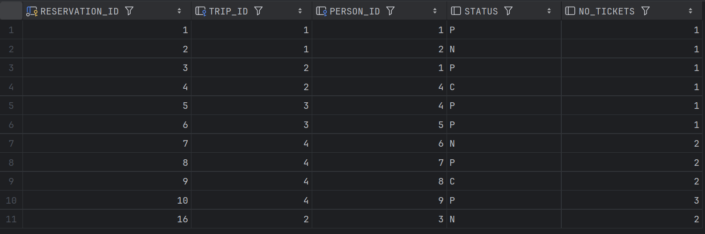

# Testy zadanie 5 - Oracle PL/SQL

- Jakub Fabia
- Michał Gontarz

Na potrzeby testów, wszystkie polecenia potrzebne do stworzenia bazy do testów wklejam poniżej. Baza przed testami została wyczyszczona, aby mieć pewność, że to rozwiązanie jest poprawne.

## Tabale i dane

```sql
create sequence s_person_seq
   start with 1
   increment by 1;

create table person
(
  person_id int not null
      constraint pk_person
         primary key,
  firstname varchar(50),
  lastname varchar(50)
);

alter table person
    modify person_id int default s_person_seq.nextval;

create sequence s_trip_seq
   start with 1
   increment by 1;

create table trip
(
  trip_id int  not null
     constraint pk_trip
         primary key,
  trip_name varchar(100),
  country varchar(50),
  trip_date date,
  max_no_places int
);

alter table trip
    modify trip_id int default s_trip_seq.nextval;

create sequence s_reservation_seq
   start with 1
   increment by 1;

create table reservation
(
  reservation_id int not null
      constraint pk_reservation
         primary key,
  trip_id int,
  person_id int,
  status char(1)
);

alter table reservation
    modify reservation_id int default s_reservation_seq.nextval;


alter table reservation
add constraint reservation_fk1 foreign key
( person_id ) references person ( person_id );

alter table reservation
add constraint reservation_fk2 foreign key
( trip_id ) references trip ( trip_id );

alter table reservation
add constraint reservation_chk1 check
(status in ('N','P','C'));


create sequence s_log_seq
   start with 1
   increment by 1;


create table log
(
    log_id int not null
         constraint pk_log
         primary key,
    reservation_id int not null,
    log_date date not null,
    status char(1)
);

alter table log
    modify log_id int default s_log_seq.nextval;

alter table log
add constraint log_chk1 check
(status in ('N','P','C')) enable;

alter table log
add constraint log_fk1 foreign key
( reservation_id ) references reservation ( reservation_id );


INSERT INTO trip(trip_name, country, trip_date, max_no_places)
VALUES ('Wycieczka do Paryza', 'Francja', TO_DATE('2023-09-12', 'YYYY-MM-DD'), 5);

INSERT INTO trip(trip_name, country, trip_date, max_no_places)
VALUES ('Piekny Krakow', 'Polska', TO_DATE('2025-07-03', 'YYYY-MM-DD'), 8);

INSERT INTO trip(trip_name, country, trip_date, max_no_places)
VALUES ('Znow do Francji', 'Francja', TO_DATE('2025-07-01', 'YYYY-MM-DD'), 7);

INSERT INTO trip(trip_name, country, trip_date, max_no_places)
VALUES ('Hel', 'Polska', TO_DATE('2025-07-01', 'YYYY-MM-DD'), 9);

-- PEOPLE
INSERT INTO person(firstname, lastname) VALUES ('Jan', 'Nowak');
INSERT INTO person(firstname, lastname) VALUES ('Jan', 'Kowalski');
INSERT INTO person(firstname, lastname) VALUES ('Jan', 'Nowakowski');
INSERT INTO person(firstname, lastname) VALUES ('Novak', 'Nowak');
INSERT INTO person(firstname, lastname) VALUES ('Anna', 'Lewandowska');
INSERT INTO person(firstname, lastname) VALUES ('Katarzyna', 'Zielinska');
INSERT INTO person(firstname, lastname) VALUES ('Piotr', 'Wojcik');
INSERT INTO person(firstname, lastname) VALUES ('Marek', 'Kwiatkowski');
INSERT INTO person(firstname, lastname) VALUES ('Magdalena', 'Lis');
INSERT INTO person(firstname, lastname) VALUES ('Tomasz', 'Grabowski');

-- Trip 1
INSERT INTO reservation(trip_id, person_id, status) VALUES (1, 1, 'P');
INSERT INTO reservation(trip_id, person_id, status) VALUES (1, 2, 'N');

-- Trip 2
INSERT INTO reservation(trip_id, person_id, status) VALUES (2, 1, 'P');
INSERT INTO reservation(trip_id, person_id, status) VALUES (2, 4, 'C');

-- Trip 3
INSERT INTO reservation(trip_id, person_id, status) VALUES (3, 4, 'P');
INSERT INTO reservation(trip_id, person_id, status) VALUES (3, 5, 'P');

-- Trip 4
INSERT INTO reservation(trip_id, person_id, status) VALUES (4, 6, 'N');
INSERT INTO reservation(trip_id, person_id, status) VALUES (4, 7, 'P');
INSERT INTO reservation(trip_id, person_id, status) VALUES (4, 8, 'C');
INSERT INTO reservation(trip_id, person_id, status) VALUES (4, 9, 'P');

ALTER TABLE reservation ADD no_tickets NUMBER(3);
ALTER TABLE log ADD no_tickets NUMBER(3);

UPDATE reservation SET no_tickets = 1 WHERE reservation_id IN (1, 2, 3, 4, 5, 6);
UPDATE reservation SET no_tickets = 2 WHERE reservation_id IN (7, 8, 9);
UPDATE reservation SET no_tickets = 3 WHERE reservation_id = 10;
```

# Widoki (zadanie 1)

```sql
CREATE OR REPLACE VIEW VW_TAKEN_PLACES AS
SELECT TRIP.TRIP_ID,
COALESCE(SUM(RESERVATION.no_tickets), 0) AS no_taken_places
FROM TRIP
LEFT OUTER JOIN RESERVATION
ON TRIP.TRIP_ID = RESERVATION.TRIP_ID
AND RESERVATION.STATUS IN ('P', 'N')
GROUP BY TRIP.TRIP_ID;


CREATE VIEW vw_trip AS
SELECT
  t.trip_id,
  t.country,
  t.trip_date,
  t.trip_name,
  t.max_no_places,
  (t.max_no_places - vt.no_taken_places) AS no_available_places
FROM trip t
LEFT JOIN VW_TAKEN_PLACES vt on t.trip_id = vt.trip_id
GROUP BY t.TRIP_ID, t.country, t.trip_date, t.trip_name, t.max_no_places, vt.no_taken_places;
```

# Funkcje pomocnicze (zadanie 3)

```sql
create FUNCTION f_valid_reservation_id(p_reservation_id IN NUMBER)
    RETURN BOOLEAN
AS
    v_dummy NUMBER;
BEGIN
    SELECT 1 INTO v_dummy
    FROM RESERVATION
    WHERE reservation_id = p_reservation_id;

    RETURN TRUE;
EXCEPTION
    WHEN NO_DATA_FOUND THEN
        RETURN FALSE;
END;

create FUNCTION f_valid_person_id(p_person_id IN NUMBER)
    RETURN BOOLEAN
AS
    v_dummy NUMBER;
BEGIN
    SELECT 1 INTO v_dummy
    FROM person
    WHERE person_id = p_person_id;

    RETURN TRUE;
EXCEPTION
    WHEN NO_DATA_FOUND THEN
        RETURN FALSE;
END;

create FUNCTION f_valid_trip_id(p_trip_id IN NUMBER)
    RETURN BOOLEAN
AS
    v_dummy NUMBER;
BEGIN
    select 1 into v_dummy
    from trip
    where trip_id = p_trip_id;
    RETURN TRUE;
EXCEPTION
    WHEN NO_DATA_FOUND THEN
        RETURN FALSE;
END;
```

# Triggery do tabeli `log` (zadanie 4)

```sql
create trigger TRG_LOG_ADD_RESERVATION
    after insert
    on RESERVATION
    for each row
begin
    insert into log (reservation_id, log_date, status, no_tickets)
    values (:new.reservation_id, sysdate,'N',:new.no_tickets);
end;

create trigger TRG_LOG_MODIFY_STATUS
    after update
    on RESERVATION
    for each row
begin
    insert into log (reservation_id, log_date, status,no_tickets)
    values (:new.reservation_id, sysdate, :new.status, :new.no_tickets);
end;


create trigger TRG_PREVENT_DELETE_RESERVATION
    before delete
    on RESERVATION
    for each row
begin
    raise_application_error(-20006, 'Deleting reservations is not allowed');
end;
```

# Procedury do wprowadzania / edycji rezerwacji (zadanie 5)

```sql
create procedure p_add_reservation_5(
    p_trip_id    number,
    p_person_id  number,
    p_no_tickets number
) is
begin
    if not f_valid_person_id(p_person_id) then
        RAISE_APPLICATION_ERROR(-20001, 'There is no person with the given ID');
    end if;
    if not F_VALID_TRIP_ID(p_trip_id) then
        raise_application_error(-20002, 'There is no trip with given id');
    end if;
```
```sql
    if p_no_tickets < 1 then
        raise_application_error(-20003, 'Number of tickets must be positive');
    end if;

    insert into reservation (trip_id, person_id, status, no_tickets)
    values (p_trip_id, p_person_id, 'N', p_no_tickets);
end;

create procedure p_modify_reservation_5(
    p_reservation_id int,
    p_no_tickets     int
) is
    v_status         varchar2(1);
    v_no_tickets     int;
begin
    if not F_VALID_RESERVATION_ID(p_reservation_id) then
        raise_application_error(-20001, 'There is no reservation with given id');
    end if;
    if p_no_tickets < 1 then
        raise_application_error(-20003, 'Number of tickets must be positive');
    end if;

    select status, NO_TICKETS
    into v_status, v_no_tickets
    from reservation
    where reservation_id = p_reservation_id;

    if v_status = 'C' then
        raise_application_error(-20004, 'This reservation is cancelled');
    end if;

    if v_no_tickets = p_no_tickets then
        raise_application_error(-20005, 'This is current number of tickets');
    end if;

    update reservation
    set no_tickets = p_no_tickets
    where reservation_id = p_reservation_id;
end;

create procedure p_modify_reservation_status_5(
    p_reservation_id       int,
    p_status               varchar2
) is
    v_status varchar2(1);
begin
    if not F_VALID_RESERVATION_ID(p_reservation_id) then
        raise_application_error(-20001, 'There is no reservation with given id');
    end if;
    if p_status not in ('N', 'P', 'C') then
        raise_application_error(-20003, 'Invalid status');
    end if;

    select status INTO v_status FROM RESERVATION WHERE RESERVATION_ID = p_reservation_id;

    if p_status = v_status then
        raise_application_error(-20004, 'This is the current reservation status');
    end if;

    update reservation
    set status = p_status
    where reservation_id = p_reservation_id;
end;
```

# Triggery, które będą testowane (zadanie 5)

```sql
create trigger TRG_ADD_RESERVATION_TICKETS
    before insert
    on RESERVATION
    for each row
DECLARE
    v_available_places int;
    v_trip_date date;
begin
    SELECT NO_AVAILABLE_PLACES, TRIP_DATE INTO v_available_places, v_trip_date FROM VW_TRIP WHERE VW_TRIP.TRIP_ID = :new.trip_id;
    if v_trip_date < sysdate then
        raise_application_error(-20001, 'The trip has already started.');
    end if;
    if :new.NO_TICKETS > v_available_places then
        raise_application_error(-20010, 'There is not enough available tickets');
    end if;
end;
```
```sql
create trigger TRG_BEFORE_RESERVATION_UPDATE
    before update
    on RESERVATION
    for each row
DECLARE
    v_trip_date date;
begin
    SELECT TRIP_DATE INTO v_trip_date FROM TRIP WHERE TRIP.TRIP_ID = :old.trip_id;
    if v_trip_date < sysdate then
        raise_application_error(-20001, 'The trip has already started.');
    end if;
end;

create trigger TRG_AFTER_RESERVATION_UPDATE
    after update
    on RESERVATION
DECLARE
    v_count INT;
begin
    SELECT COUNT(*)
    INTO v_count
    FROM (SELECT *
          FROM VW_TRIP
          WHERE NO_AVAILABLE_PLACES < 0);

    IF v_count > 0 THEN
        RAISE_APPLICATION_ERROR(-20001, 'There are not enough available tickets');
    end if;
end;
```

# Testy

## `TRG_ADD_RESERVATION_TICKETS`

### Dodanie rezerwacji na wycieczkę, która już się odbyła `trip_id = 1, data 2023-09-12 < SYSDATE`
- Oczekujemy wyjątku: "The trip has already started."

```sql
BEGIN
  p_add_reservation_5(
    p_trip_id    => 1,
    p_person_id  => 3,
    p_no_tickets => 1
  );
END;
```

```
[72000][20001]
	ORA-20001: The trip has already started.
	ORA-06512: at "BD_421250.TRG_ADD_RESERVATION_TICKETS", line 7
	ORA-04088: error during execution of trigger 'BD_421250.TRG_ADD_RESERVATION_TICKETS'
	ORA-06512: at "BD_421250.P_ADD_RESERVATION_5", line 17
	ORA-06512: at line 2
Position: 0
```

```
BD_421250> SELECT * FROM LOG
0 rows retrieved in 347 ms (execution: 12 ms, fetching: 335 ms)
```

```
BD_421250> SELECT * FROM LOG
10 rows retrieved starting from 1 in 133 ms (execution: 6 ms, fetching: 127 ms)
```


### Dodanie rezerwacji przekraczającej liczbę dostępnych miejsc `trip_id = 2, max = 8, zajęte = 1, rezerujemy 8`
- Próbujemy zarezerwować 8 biletów. Oczekujemy wyjątku: "There is not enough available tickets"

```sql
BEGIN
  p_add_reservation_5(
    p_trip_id    => 2,
    p_person_id  => 3,
    p_no_tickets => 8
  );
END;
```

```
[72000][20002]
	ORA-20002: There is not enough available tickets
	ORA-06512: at "BD_421250.TRG_ADD_RESERVATION_TICKETS", line 10
	ORA-04088: error during execution of trigger 'BD_421250.TRG_ADD_RESERVATION_TICKETS'
	ORA-06512: at "BD_421250.P_ADD_RESERVATION_5", line 17
	ORA-06512: at line 2
Position: 0
```

```
BD_421250> SELECT * FROM LOG
0 rows retrieved in 91 ms (execution: 8 ms, fetching: 83 ms)
```

```
BD_421250> SELECT * FROM RESERVATION
10 rows retrieved starting from 1 in 165 ms (execution: 7 ms, fetching: 158 ms)
```

Stan tabeli `RESERVATION` taki sam jak wyżej.

### Dodanie prawidłowej rezerwacji `trip_id = 2, dostępne miejsca = 7, rezerwujemy 2`
- Oczekujemy powodzenia, wpisu w tabeli RESERVATION oraz LOG

```sql
BEGIN
  p_add_reservation_5(
    p_trip_id    => 2,
    p_person_id  => 3,
    p_no_tickets => 2
  );
END;
```

```
completed in 7 ms
```

```
BD_421250> SELECT * FROM LOG
1 row retrieved starting from 1 in 173 ms (execution: 7 ms, fetching: 166 ms)
```


```
BD_421250> SELECT * FROM RESERVATION
11 rows retrieved starting from 1 in 260 ms (execution: 7 ms, fetching: 253 ms)
```



## `TRG_BEFORE_RESERVATION_UPDATE` i `TRG_AFTER_RESERVATION_UPDATE`

### Modyfikacja liczby biletów w rezerwacji na wycieczkę, która już się odbyła `reservation_id = 1 (trip_id = 1, data 2023-09-12 < SYSDATE)`
- Oczekujemy wyjątku BEFORE UPDATE: "The trip has already started."

```sql
BEGIN
  p_modify_reservation_5(
    p_reservation_id => 1,
    p_no_tickets     => 2
  );
END;
```

```
[72000][20001]
	ORA-20001: The trip has already started.
	ORA-06512: at "BD_421250.TRG_BEFORE_RESERVATION_UPDATE", line 6
	ORA-04088: error during execution of trigger 'BD_421250.TRG_BEFORE_RESERVATION_UPDATE'
	ORA-06512: at "BD_421250.P_MODIFY_RESERVATION_5", line 28
	ORA-06512: at line 2
Position: 0
```

```
BD_421250> SELECT * FROM LOG
0 rows retrieved in 83 ms (execution: 6 ms, fetching: 77 ms)
```

```
BD_421250> SELECT * FROM RESERVATION
10 rows retrieved starting from 1 in 260 ms (execution: 8 ms, fetching: 252 ms)
```

Stan tabeli `RESERVATION` taki sam jak w pierwszym teście.

### Modyfikacja rezerwacji tak, aby doprowadzić do przekroczenia dostępnych miejsc `trip_id = 3, max 7, aktualnie 2 zajęte`
- Próbujemy ustawić dla `reservation_id = 5 p_no_tickets = 7` → po aktualizacji razem 7 + 1 = 8 > 7  
- Oczekujemy AFTER UPDATE: "There are not enough available tickets"

```sql
BEGIN
  p_modify_reservation_5(
    p_reservation_id => 5,
    p_no_tickets     => 7
  );
END;
```
```
[72000][20001]
	ORA-20001: There are not enough available tickets
	ORA-06512: at "BD_421250.TRG_AFTER_RESERVATION_UPDATE", line 11
	ORA-04088: error during execution of trigger 'BD_421250.TRG_AFTER_RESERVATION_UPDATE'
	ORA-06512: at "BD_421250.P_MODIFY_RESERVATION_5", line 28
	ORA-06512: at line 2
Position: 0
```

```
BD_421250> SELECT * FROM LOG
0 rows retrieved in 167 ms (execution: 9 ms, fetching: 158 ms)
```

```
BD_421250> SELECT * FROM RESERVATION
10 rows retrieved starting from 1 in 323 ms (execution: 6 ms, fetching: 317 ms)
```

Stan tabeli `RESERVATION` taki sam jak w pierwszym teście.

### Prawidłowa modyfikacja liczby biletów `reservation_id = 3, trip_id = 2, no_tickets zmień z 1 na 2`
- Oczekujemy powodzenia

```sql
BEGIN
  p_modify_reservation_5(
    p_reservation_id => 3,
    p_no_tickets     => 2
  );
END;
```

```
completed in 8 ms
```

```
BD_421250> SELECT * FROM LOG
1 row retrieved starting from 1 in 137 ms (execution: 7 ms, fetching: 130 ms)
```


```
BD_421250> SELECT * FROM RESERVATION
10 rows retrieved starting from 1 in 376 ms (execution: 8 ms, fetching: 368 ms)
```


Widać, że zmiana się powiodła (w porównaniu do poprzedniego stanu tej tabeli).

### Zmiana statusu rezerwacji na wycieczkę, która się odbyła `reservation_id = 2, trip_id = 1, status 'N' → 'P'`
- Oczekujemy wyjątku BEFORE UPDATE: "The trip has already started."

```sql
BEGIN
  p_modify_reservation_status_5(
    p_reservation_id => 2,
    p_status         => 'P'
  );
END;
```

```
[72000][20001]
	ORA-20001: The trip has already started.
	ORA-06512: at "BD_421250.TRG_BEFORE_RESERVATION_UPDATE", line 6
	ORA-04088: error during execution of trigger 'BD_421250.TRG_BEFORE_RESERVATION_UPDATE'
	ORA-06512: at "BD_421250.P_MODIFY_RESERVATION_STATUS_5", line 20
	ORA-06512: at line 2
Position: 0
```

```
BD_421250> SELECT * FROM LOG
0 rows retrieved in 286 ms (execution: 10 ms, fetching: 276 ms)
```

```
BD_421250> SELECT * FROM RESERVATION
10 rows retrieved starting from 1 in 114 ms (execution: 9 ms, fetching: 105 ms)
```

Stan tabeli `RESERVATION` taki sam jak w pierwszym teście.

### Zmiana statusu `C` na inny, gdy nie ma już dostępnych biletów `trip_id = 4, max = 9`
- Oczekujemy AFTER UPDATE: "There are not enough available tickets"

Do tabeli rezerwacji trzeba dodać jeszcze jedną.

```sql
BEGIN
  p_add_reservation_5(
    p_trip_id    => 4,
    p_person_id  => 1,
    p_no_tickets => 1
  );
END;
```


W tym momencie mamy jedno wolne miejsce.


Więc zmienimy status `reservation_id = 9`.

```sql
BEGIN
  p_modify_reservation_status_5(
    p_reservation_id => 9,
    p_status         => 'P'
  );
END;
```

```
[72000][20001]
	ORA-20001: There are not enough available tickets
	ORA-06512: at "BD_421250.TRG_AFTER_RESERVATION_UPDATE", line 11
	ORA-04088: error during execution of trigger 'BD_421250.TRG_AFTER_RESERVATION_UPDATE'
	ORA-06512: at "BD_421250.P_MODIFY_RESERVATION_STATUS_5", line 20
	ORA-06512: at line 2
Position: 0
```

```
BD_421250> SELECT * FROM LOG
1 row retrieved starting from 1 in 310 ms (execution: 12 ms, fetching: 298 ms)
```


```
BD_421250> SELECT * FROM RESERVATION
11 rows retrieved starting from 1 in 348 ms (execution: 7 ms, fetching: 341 ms)
```


### Zmiana statusu `C` na inny, gdy jest wystarczająco biletów
- Oczekujemy powodzenia

```sql
BEGIN
  p_modify_reservation_status_5(
    p_reservation_id => 9,
    p_status         => 'P'
  );
END;
```

```
completed in 11 ms
```

```
BD_421250> SELECT * FROM LOG
1 row retrieved starting from 1 in 228 ms (execution: 7 ms, fetching: 221 ms)
```


```
BD_421250> SELECT * FROM RESERVATION
10 rows retrieved starting from 1 in 284 ms (execution: 7 ms, fetching: 277 ms)
```


# Powyższe testy zweryfikowały poprawne działanie triggerów dodawania i aktualizowania rezerwacji.