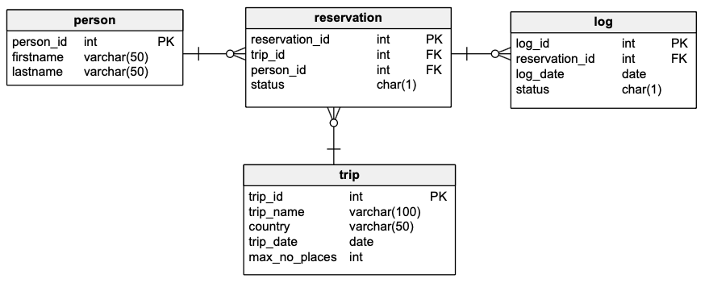

# Oracle PL/Sql
widoki, funkcje, procedury, triggery

---

Imiona i nazwiska autorów:<br>
Jakub Fabia<br>
Michał Gontarz

---
<style>
  {
    font-size: 16pt;
  }
</style> 

<style scoped>
 li, p {
    font-size: 14pt;
  }
</style> 

<style scoped>
 pre {
    font-size: 10pt;
  }
</style> 

# Tabele




- `Trip`  - wycieczki
	- `trip_id` - identyfikator, klucz główny
	- `trip_name` - nazwa wycieczki
	- `country` - nazwa kraju
	- `trip_date` - data
	- `max_no_places` -  maksymalna liczba miejsc na wycieczkę
- `Person` - osoby
	- `person_id` - identyfikator, klucz główny
	- `firstname` - imię
	- `lastname` - nazwisko


- `Reservation`  - rezerwacje/bilety na wycieczkę
	- `reservation_id` - identyfikator, klucz główny
	- `trip_id` - identyfikator wycieczki
	- `person_id` - identyfikator osoby
	- `status` - status rezerwacji
		- `N` – New - Nowa
		- `P` – Confirmed and Paid – Potwierdzona  i zapłacona
		- `C` – Canceled - Anulowana
- `Log` - dziennik zmian statusów rezerwacji 
	- `log_id` - identyfikator, klucz główny
	- `reservation_id` - identyfikator rezerwacji
	- `log_date` - data zmiany
	- `status` - status


```sql
create sequence s_person_seq  
   start with 1  
   increment by 1;

create table person  
(  
  person_id int not null
      constraint pk_person  
         primary key,
  firstname varchar(50),  
  lastname varchar(50)
)  

alter table person  
    modify person_id int default s_person_seq.nextval;
   
```


```sql
create sequence s_trip_seq  
   start with 1  
   increment by 1;

create table trip  
(  
  trip_id int  not null
     constraint pk_trip  
         primary key, 
  trip_name varchar(100),  
  country varchar(50),  
  trip_date date,  
  max_no_places int
);  

alter table trip 
    modify trip_id int default s_trip_seq.nextval;
```


```sql
create sequence s_reservation_seq  
   start with 1  
   increment by 1;

create table reservation  
(  
  reservation_id int not null
      constraint pk_reservation  
         primary key, 
  trip_id int,  
  person_id int,  
  status char(1)
);  

alter table reservation 
    modify reservation_id int default s_reservation_seq.nextval;


alter table reservation  
add constraint reservation_fk1 foreign key  
( person_id ) references person ( person_id ); 
  
alter table reservation  
add constraint reservation_fk2 foreign key  
( trip_id ) references trip ( trip_id );  
  
alter table reservation  
add constraint reservation_chk1 check  
(status in ('N','P','C'));

```


```sql
create sequence s_log_seq  
   start with 1  
   increment by 1;


create table log  
(  
    log_id int not null
         constraint pk_log  
         primary key,
    reservation_id int not null,  
    log_date date not null,  
    status char(1)
);  

alter table log 
    modify log_id int default s_log_seq.nextval;
  
alter table log  
add constraint log_chk1 check  
(status in ('N','P','C')) enable;
  
alter table log  
add constraint log_fk1 foreign key  
( reservation_id ) references reservation ( reservation_id );
```


---
# Dane


Należy wypełnić  tabele przykładowymi danymi 
- 4 wycieczki
- 10 osób
- 10 rezerwacji

Dane testowe powinny być różnorodne (wycieczki w przyszłości, wycieczki w przeszłości, rezerwacje o różnym statusie itp.) tak, żeby umożliwić testowanie napisanych procedur.

W razie potrzeby należy zmodyfikować dane tak żeby przetestować różne przypadki.


```sql
-- TRIPS
INSERT INTO trip(trip_name, country, trip_date, max_no_places)  
VALUES ('Wycieczka do Paryza', 'Francja', TO_DATE('2023-09-12', 'YYYY-MM-DD'), 5);  

INSERT INTO trip(trip_name, country, trip_date, max_no_places)  
VALUES ('Piekny Krakow', 'Polska', TO_DATE('2025-05-03', 'YYYY-MM-DD'), 8);  

INSERT INTO trip(trip_name, country, trip_date, max_no_places)  
VALUES ('Znow do Francji', 'Francja', TO_DATE('2025-05-01', 'YYYY-MM-DD'), 7);  

INSERT INTO trip(trip_name, country, trip_date, max_no_places)  
VALUES ('Hel', 'Polska', TO_DATE('2025-05-01', 'YYYY-MM-DD'), 9);
```
```sql
-- PEOPLE
INSERT INTO person(firstname, lastname) VALUES ('Jan', 'Nowak');  
INSERT INTO person(firstname, lastname) VALUES ('Jan', 'Kowalski');  
INSERT INTO person(firstname, lastname) VALUES ('Jan', 'Nowakowski');  
INSERT INTO person(firstname, lastname) VALUES ('Novak', 'Nowak');  
INSERT INTO person(firstname, lastname) VALUES ('Anna', 'Lewandowska');  
INSERT INTO person(firstname, lastname) VALUES ('Katarzyna', 'Zielinska');  
INSERT INTO person(firstname, lastname) VALUES ('Piotr', 'Wojcik');  
INSERT INTO person(firstname, lastname) VALUES ('Marek', 'Kwiatkowski');  
INSERT INTO person(firstname, lastname) VALUES ('Magdalena', 'Lis');  
INSERT INTO person(firstname, lastname) VALUES ('Tomasz', 'Grabowski');
```
```sql
-- Trip 1
INSERT INTO reservation(trip_id, person_id, status) VALUES (1, 1, 'P');  
INSERT INTO reservation(trip_id, person_id, status) VALUES (1, 2, 'N');  

-- Trip 2  
INSERT INTO reservation(trip_id, person_id, status) VALUES (2, 1, 'P');  
INSERT INTO reservation(trip_id, person_id, status) VALUES (2, 4, 'C');  

-- Trip 3  
INSERT INTO reservation(trip_id, person_id, status) VALUES (3, 4, 'P');  
INSERT INTO reservation(trip_id, person_id, status) VALUES (3, 5, 'P');  

-- Trip 4  
INSERT INTO reservation(trip_id, person_id, status) VALUES (4, 6, 'N');  
INSERT INTO reservation(trip_id, person_id, status) VALUES (4, 7, 'P');  
INSERT INTO reservation(trip_id, person_id, status) VALUES (4, 8, 'C');  
INSERT INTO reservation(trip_id, person_id, status) VALUES (4, 9, 'P');  
```


proszę pamiętać o zatwierdzeniu transakcji

---
# Zadanie 0 - modyfikacja danych, transakcje

Należy zmodyfikować model danych tak żeby rezerwacja mogła dotyczyć kilku miejsc/biletów na wycieczkę
- do tabeli reservation należy dodać pole
	- no_tickets
- do tabeli log należy dodac pole
	- no_tickets
	
Należy zmodyfikować zestaw danych testowych

Należy przeprowadzić kilka eksperymentów związanych ze wstawianiem, modyfikacją i usuwaniem danych
oraz wykorzystaniem transakcji

Skomentuj dzialanie transakcji. Jak działa polecenie `commit`, `rollback`?.
Co się dzieje w przypadku wystąpienia błędów podczas wykonywania transakcji? Porównaj sposób programowania operacji wykorzystujących transakcje w Oracle PL/SQL ze znanym ci systemem/językiem MS Sqlserver T-SQL

pomocne mogą być materiały dostępne tu:
https://upel.agh.edu.pl/mod/folder/view.php?id=311899
w szczególności dokument: `1_ora_modyf.pdf`


```sql
ALTER TABLE reservation ADD no_tickets NUMBER(3);
ALTER TABLE log ADD no_tickets NUMBER(3);

UPDATE reservation SET no_tickets = 1 WHERE reservation_id IN (1, 2, 3, 4, 5, 6);
UPDATE reservation SET no_tickets = 2 WHERE reservation_id IN (7, 8, 9);
UPDATE reservation SET no_tickets = 3 WHERE reservation_id = 10;
COMMIT; 

-- Zauważyłem, że po usunięciu danych z jakiejkolwiek tabeli, klucze główne nie zaczynają się od 1, ale od następnej wartości sprzed usunięcia.
-- Podczas eksperymentów zauważyłem zdecydowanie lepszą wydajność pracy na danych które nie są "scommitowane". Przy pracy w MS SQL Server operacje wykonywały się znacznie wolniej niż w Oracle PL/SQL. 
-- Ponadto uważam, że jest to lepiej zrobione, ponieważ nie da się zapomnieć BEGIN TRANSACTION jak w MS SQL Server, a w przypadku wystąpienia błędu w komendzie, skutki są mniej katastrofalne.

-- Jakub Fabia
```

---
# Zadanie 1 - widoki


Tworzenie widoków. Należy przygotować kilka widoków ułatwiających dostęp do danych. Należy zwrócić uwagę na strukturę kodu (należy unikać powielania kodu)

Widoki:
-   `vw_reservation`
	- widok łączy dane z tabel: `trip`,  `person`,  `reservation`
	- zwracane dane:  `reservation_id`,  `country`, `trip_date`, `trip_name`, `firstname`, `lastname`, `status`, `trip_id`, `person_id`, `no_tickets`
- `vw_trip` 
	- widok pokazuje liczbę wolnych miejsc na każdą wycieczkę
	- zwracane dane: `trip_id`, `country`, `trip_date`, `trip_name`, `max_no_places`, `no_available_places` (liczba wolnych miejsc)
-  `vw_available_trip`
	- podobnie jak w poprzednim punkcie, z tym że widok pokazuje jedynie dostępne wycieczki (takie które są w przyszłości i są na nie wolne miejsca)


Proponowany zestaw widoków można rozbudować wedle uznania/potrzeb
- np. można dodać nowe/pomocnicze widoki, funkcje
- np. można zmienić def. widoków, dodając nowe/potrzebne pola

# Zadanie 1  - rozwiązanie

```sql
CREATE VIEW vw_reservation AS
SELECT 
  r.reservation_id, 
  t.country, 
  t.trip_date, 
  t.trip_name, 
  p.firstname, 
  p.lastname, 
  r.status, 
  r.trip_id, 
  r.person_id, 
  r.no_tickets
FROM reservation r
JOIN trip t ON r.trip_id = t.trip_id
JOIN person p ON r.person_id = p.person_id;

-- Jakub Fabia
```
```sql
-- Widok pomocniczy do obliczania ilości zajętych miejsc 

SELECT TRIP.TRIP_ID, 
COALESCE(SUM(RESERVATION.no_tickets), 0) AS no_taken_places
FROM TRIP
LEFT OUTER JOIN RESERVATION 
ON TRIP.TRIP_ID = RESERVATION.TRIP_ID 
AND RESERVATION.STATUS IN ('P', 'N')
GROUP BY TRIP.TRIP_ID

-- Jakub Fabia
```
```sql
CREATE VIEW vw_trip AS
SELECT
  t.trip_id,
  t.country,
  t.trip_date,
  t.trip_name,
  t.max_no_places,
  (t.max_no_places - vt.no_taken_places) AS no_available_places
FROM trip t
LEFT JOIN VW_TAKEN_PLACES vt on t.trip_id = vt.trip_id
GROUP BY t.TRIP_ID, t.country, t.trip_date, t.trip_name, t.max_no_places, vt.no_taken_places

-- Jakub Fabia
```
```sql
CREATE VIEW vw_available_trip AS
SELECT * 
FROM vw_trip 
WHERE trip_date > SYSDATE 
AND no_available_places > 0;

-- Jakub Fabia
```


---
# Zadanie 2  - funkcje


Tworzenie funkcji pobierających dane/tabele. Podobnie jak w poprzednim przykładzie należy przygotować kilka funkcji ułatwiających dostęp do danych

Procedury:
- `f_trip_participants`
	- zadaniem funkcji jest zwrócenie listy uczestników wskazanej wycieczki
	- parametry funkcji: `trip_id`
	- funkcja zwraca podobny zestaw danych jak widok  `vw_reservation`
-  `f_person_reservations`
	- zadaniem funkcji jest zwrócenie listy rezerwacji danej osoby 
	- parametry funkcji: `person_id`
	- funkcja zwraca podobny zestaw danych jak widok `vw_reservation`
-  `f_available_trips_to`
	- zadaniem funkcji jest zwrócenie listy wycieczek do wskazanego kraju, dostępnych w zadanym okresie czasu (od `date_from` do `date_to`)
	- parametry funkcji: `country`, `date_from`, `date_to`


Funkcje powinny zwracać tabelę/zbiór wynikowy. Należy rozważyć dodanie kontroli parametrów, (np. jeśli parametrem jest `trip_id` to można sprawdzić czy taka wycieczka istnieje). Podobnie jak w przypadku widoków należy zwrócić uwagę na strukturę kodu

Czy kontrola parametrów w przypadku funkcji ma sens?
- jakie są zalety/wady takiego rozwiązania?

Proponowany zestaw funkcji można rozbudować wedle uznania/potrzeb
- np. można dodać nowe/pomocnicze funkcje/procedury

# Zadanie 2  - rozwiązanie

```sql
-- Używam akurat tego zestawu danych z vw_reservation, ponieważ są to jedyne unikalne dane dla danego uczestnika, zakładam, że uczestnik to osoba, która już zapłaciła.
create or replace type obj_participant as OBJECT
(
    firstname VARCHAR2(50),
    lastname VARCHAR2(50),
    no_tickets NUMBER(3)
);
create or replace type obj_participant_table is table of obj_participant;

CREATE FUNCTION f_trip_participants(trip_id IN NUMBER)
    RETURN obj_participant_table
AS
    RESULT obj_participant_table;
BEGIN
    SELECT obj_participant(vw.FIRSTNAME, vw.LASTNAME, vw.NO_TICKETS)
    BULK COLLECT
    INTO RESULT
    FROM VW_RESERVATION vw
    WHERE f_trip_participants.TRIP_ID = vw.TRIP_ID
    AND vw.STATUS = 'P';
    RETURN RESULT;
end;

-- Jakub Fabia
```
```sql
create or replace type obj_reservation as OBJECT
(
    country VARCHAR2(50),
    trip_date DATE,
    trip_name VARCHAR2(100),
    status VARCHAR2(1),
    no_tickets INT
);
create or replace type obj_reservation_table is table of obj_reservation;

CREATE or replace FUNCTION f_person_reservations(PERSON_ID IN NUMBER)
    RETURN obj_reservation_table
AS
    RESULT obj_reservation_table;
BEGIN
    SELECT obj_reservation(vw.COUNTRY, vw.TRIP_DATE, vw.TRIP_NAME, vw.STATUS, vw.NO_TICKETS)
    BULK COLLECT
    INTO RESULT
    FROM VW_RESERVATION vw
    WHERE f_person_reservations.PERSON_ID = vw.PERSON_ID;
    RETURN RESULT;
end;

-- Michał Gontarz
```
```sql
create or replace type obj_trip as OBJECT
(
    trip_date DATE,
    trip_name VARCHAR2(100),
    max_no_places INT
);
create or replace type obj_trip_table is table of obj_trip;

create or replace FUNCTION f_available_trips_to(country IN VARCHAR2, date_from IN DATE, date_to IN DATE)
    RETURN obj_trip_table
AS
    RESULT obj_trip_table;
BEGIN
    SELECT obj_trip(trip.TRIP_DATE, trip.TRIP_NAME, trip.MAX_NO_PLACES)
    BULK COLLECT
    INTO RESULT
    FROM TRIP
    WHERE f_available_trips_to.country = trip.COUNTRY
    AND trip.TRIP_DATE BETWEEN date_from AND date_to;
    RETURN RESULT;
end;
-- Rozważałem przyjmowanie VARCHAR2 jako argumenty dla dat a potem parsowanie w procedurze ale stwierdziłem, że dla ułatwienia używania funkcji SYSDATE tak będzie lepiej.

-- Jakub Fabia
```


---
# Zadanie 3  - procedury


Tworzenie procedur modyfikujących dane. Należy przygotować zestaw procedur pozwalających na modyfikację danych oraz kontrolę poprawności ich wprowadzania

Procedury
- `p_add_reservation`
	- zadaniem procedury jest dopisanie nowej rezerwacji
	- parametry: `trip_id`, `person_id`,  `no_tickets`
	- procedura powinna kontrolować czy wycieczka jeszcze się nie odbyła, i czy sa wolne miejsca
	- procedura powinna również dopisywać inf. do tabeli `log`
- `p_modify_reservation_status`
	- zadaniem procedury jest zmiana statusu rezerwacji 
	- parametry: `reservation_id`, `status`
	- procedura powinna kontrolować czy możliwa jest zmiana statusu, np. zmiana statusu już anulowanej wycieczki (przywrócenie do stanu aktywnego nie zawsze jest możliwa – może już nie być miejsc)
	- procedura powinna również dopisywać inf. do tabeli `log`
- `p_modify_reservation`
	- zadaniem procedury jest zmiana statusu rezerwacji 
	- parametry: `reservation_id`, `no_iickets`
	- procedura powinna kontrolować czy możliwa jest zmiana liczby sprzedanych/zarezerwowanych biletów – może już nie być miejsc
	- procedura powinna również dopisywać inf. do tabeli `log`
- `p_modify_max_no_places`
	- zadaniem procedury jest zmiana maksymalnej liczby miejsc na daną wycieczkę 
	- parametry: `trip_id`, `max_no_places`
	- nie wszystkie zmiany liczby miejsc są dozwolone, nie można zmniejszyć liczby miejsc na wartość poniżej liczby zarezerwowanych miejsc

Należy rozważyć użycie transakcji

Należy zwrócić uwagę na kontrolę parametrów (np. jeśli parametrem jest trip_id to należy sprawdzić czy taka wycieczka istnieje, jeśli robimy rezerwację to należy sprawdzać czy są wolne miejsca itp..)


Proponowany zestaw procedur można rozbudować wedle uznania/potrzeb
- np. można dodać nowe/pomocnicze funkcje/procedury

# Zadanie 3  - rozwiązanie

```sql
-- Funkcje sprawdzające poprawność danych i nie tylko
create FUNCTION f_valid_person_id(p_person_id IN NUMBER)
    RETURN BOOLEAN
AS
    v_dummy NUMBER;
BEGIN
    SELECT 1 INTO v_dummy
    FROM person
    WHERE person_id = p_person_id;

    RETURN TRUE;
EXCEPTION
    WHEN NO_DATA_FOUND THEN
        RETURN FALSE;
END;

create FUNCTION f_available_trip(p_trip_id IN NUMBER)
    RETURN BOOLEAN
AS
    v_dummy NUMBER;
BEGIN
    select 1 into v_dummy
    from VW_AVAILABLE_TRIP
    where trip_id = p_trip_id;
    RETURN TRUE;
EXCEPTION
    WHEN NO_DATA_FOUND THEN
        RETURN FALSE;
END;

create FUNCTION f_valid_trip_id(p_trip_id IN NUMBER)
    RETURN BOOLEAN
AS
    v_dummy NUMBER;
BEGIN
    select 1 into v_dummy
    from trip
    where trip_id = p_trip_id;
    RETURN TRUE;
EXCEPTION
    WHEN NO_DATA_FOUND THEN
        RETURN FALSE;
END;

create FUNCTION f_valid_reservation_id(p_reservation_id IN NUMBER)
    RETURN BOOLEAN
AS
    v_dummy NUMBER;
BEGIN
    SELECT 1 INTO v_dummy
    FROM RESERVATION
    WHERE reservation_id = p_reservation_id;

    RETURN TRUE;
EXCEPTION
    WHEN NO_DATA_FOUND THEN
        RETURN FALSE;
END;

-- Jakub Fabia
```

```sql
create procedure p_add_reservation(
    p_trip_id    number,
    p_person_id  number,
    p_no_tickets number
) is
    v_reservation_id   number;
begin
    if not f_valid_person_id(p_person_id) then
        RAISE_APPLICATION_ERROR(-20001, 'There is no person with the given ID');
    end if;
    if not F_VALID_TRIP_ID(p_trip_id) then
        raise_application_error(-20002, 'There is no trip with given id');
    end if;
    if p_no_tickets < 1 then
        raise_application_error(-20003, 'Number of tickets must be positive');
    end if;
    if not F_AVAILABLE_TRIP(p_trip_id) then
        raise_application_error(-20004, 'Trip is not available');
    end if;

    insert into reservation (trip_id, person_id, status, no_tickets)
    values (p_trip_id, p_person_id, 'N', p_no_tickets)
    returning reservation_id into v_reservation_id;
    insert into log (reservation_id, log_date, status, no_tickets)
    values (v_reservation_id, sysdate, 'N', p_no_tickets );
end p_add_reservation;

-- Jakub Fabia
```
```sql
create procedure p_modify_reservation_status(
    p_reservation_id       int,
    p_status               varchar2
) is
    v_status               varchar2(1);
    v_no_available_places  int;
    v_trip_id              int;
    v_date                 date;
    v_no_tickets           int;
begin
    if not F_VALID_RESERVATION_ID(p_reservation_id) then
        raise_application_error(-20001, 'There is no reservation with given id');
    end if;
    if p_status not in ('N', 'P', 'C') then
        raise_application_error(-20003, 'Invalid status');
    end if;

    select status, trip_id, no_tickets
    into v_status, v_trip_id, v_no_tickets
    from reservation
    where reservation_id = p_reservation_id;

    select no_available_places, trip_date
    into v_no_available_places, v_date
    from vw_trip
    where trip_id = v_trip_id;

    if v_date <= sysdate then
        raise_application_error(-20002, 'It is too late to change a trip status');
    end if;
    if p_status = v_status then
        raise_application_error(-20004, 'The reservation already has such status');
    end if;

    if (p_status in ('N', 'P') and v_status = 'C' and v_no_tickets > v_no_available_places) then
        raise_application_error(-20005, 'There are no more available places');
    end if;

    update reservation
    set status = p_status
    where reservation_id = p_reservation_id;

    insert into log(reservation_id, log_date, status, no_tickets)
    values(p_reservation_id, sysdate, p_status, v_no_tickets);

end p_modify_reservation_status;

-- Michał Gontarz
```

```sql
create procedure p_modify_reservation(
    p_reservation_id int,
    p_no_tickets     int
) is
    v_current_no_tickets     int;
    v_date                   date;
    v_trip_id                int;
    v_no_available_places    int;
    v_status                 varchar2(1);
    v_change_in_tickets      int;
begin
    if not F_VALID_RESERVATION_ID(p_reservation_id) then
        raise_application_error(-20001, 'There is no reservation with given id');
    end if;
    if p_no_tickets < 1 then
        raise_application_error(-20003, 'Number of tickets must be positive');
    end if;

    select no_tickets, trip_id, status
    into v_current_no_tickets, v_trip_id, v_status
    from reservation
    where reservation_id = p_reservation_id;

    select trip_date, no_available_places
    into v_date, v_no_available_places
    from vw_trip
    where trip_id = v_trip_id;

    if v_date < sysdate then
        raise_application_error(-20002, 'It is too late');
    end if;

    v_change_in_tickets := p_no_tickets - v_current_no_tickets;

    if v_status = 'C' then
        raise_application_error(-20004, 'This reservation is cancelled');
    end if;
    
    if v_change_in_tickets > v_no_available_places then
        raise_application_error(-20003, 'There are not enough places left');
    end if;

    if v_change_in_tickets > 0 then
        v_status := 'N';
    end if;

    update reservation
    set no_tickets = p_no_tickets
    where reservation_id = p_reservation_id;

    insert into log(reservation_id, log_date, status, no_tickets)
    values(p_reservation_id, sysdate, v_status, v_change_in_tickets);
end p_modify_reservation;

-- Michał Gontarz
```

```sql
create procedure p_modify_max_no_places (
    p_trip_id number,
    p_max_no_places number
) is
    v_reserved_places number;
    v_trip_date date;
begin
    if not F_VALID_TRIP_ID(p_trip_id) then
        raise_application_error(-20001, 'There is no trip with given id');
    end if;
    select max_no_places - no_available_places, trip_date
    into v_reserved_places, v_trip_date
    from vw_trip
    where p_trip_id = trip_id;

    if v_trip_date < sysdate then
        raise_application_error(-20002, 'This trip has already started');
    end if;

    if p_max_no_places < v_reserved_places then
        raise_application_error(-20003, 'Maximal number of places is too small');
    end if;

    update trip
    set max_no_places = p_max_no_places
    where trip_id = p_trip_id;
end p_modify_max_no_places;

-- Michał Gontarz
```


---
# Zadanie 4  - triggery


Zmiana strategii zapisywania do dziennika rezerwacji. Realizacja przy pomocy triggerów

Należy wprowadzić zmianę, która spowoduje, że zapis do dziennika będzie realizowany przy pomocy trigerów

Triggery:
- trigger/triggery obsługujące 
	- dodanie rezerwacji
	- zmianę statusu
	- zmianę liczby zarezerwowanych/kupionych biletów
- trigger zabraniający usunięcia rezerwacji

Oczywiście po wprowadzeniu tej zmiany należy "uaktualnić" procedury modyfikujące dane. 

>UWAGA
Należy stworzyć nowe wersje tych procedur (dodając do nazwy dopisek 4 - od numeru zadania). Poprzednie wersje procedur należy pozostawić w celu  umożliwienia weryfikacji ich poprawności

Należy przygotować procedury: `p_add_reservation_4`, `p_modify_reservation_status_4` , `p_modify_reservation_4`


# Zadanie 4  - rozwiązanie

```sql
-- Zmodyfikowane procedury
create procedure p_add_reservation_4(
    p_trip_id    number,
    p_person_id  number,
    p_no_tickets number
) is
    v_reservation_id   number;
begin
    if not f_valid_person_id(p_person_id) then
        RAISE_APPLICATION_ERROR(-20001, 'There is no person with the given ID');
    end if;
    if not F_VALID_TRIP_ID(p_trip_id) then
        raise_application_error(-20002, 'There is no trip with given id');
    end if;
    if p_no_tickets < 1 then
        raise_application_error(-20003, 'Number of tickets must be positive');
    end if;
    if not F_AVAILABLE_TRIP(p_trip_id) then
        raise_application_error(-20004, 'Trip is not available');
    end if;

    insert into reservation (trip_id, person_id, status, no_tickets)
    values (p_trip_id, p_person_id, 'N', p_no_tickets)
    returning reservation_id into v_reservation_id;
end;


create procedure p_modify_reservation_status_4(
    p_reservation_id       int,
    p_status               varchar2
) is
    v_status               varchar2(1);
    v_no_available_places  int;
    v_trip_id              int;
    v_date                 date;
    v_no_tickets           int;
begin
    if not F_VALID_RESERVATION_ID(p_reservation_id) then
        raise_application_error(-20001, 'There is no reservation with given id');
    end if;
    if p_status not in ('N', 'P', 'C') then
        raise_application_error(-20003, 'Invalid status');
    end if;

    select status, trip_id, no_tickets
    into v_status, v_trip_id, v_no_tickets
    from reservation
    where reservation_id = p_reservation_id;

    select no_available_places, trip_date
    into v_no_available_places, v_date
    from vw_trip
    where trip_id = v_trip_id;

    if v_date <= sysdate then
        raise_application_error(-20002, 'It is too late to change a trip status');
    end if;
    if p_status = v_status then
        raise_application_error(-20004, 'The reservation already has such status');
    end if;

    if (p_status in ('N', 'P') and v_status = 'C' and v_no_tickets > v_no_available_places) then
        raise_application_error(-20005, 'There are no more available places');
    end if;

    update reservation
    set status = p_status
    where reservation_id = p_reservation_id;
end;


create procedure p_modify_reservation_4(
    p_reservation_id int,
    p_no_tickets     int
) is
    v_current_no_tickets     int;
    v_date                   date;
    v_trip_id                int;
    v_no_available_places    int;
    v_status                 varchar2(1);
    v_change_in_tickets      int;
begin
    if not F_VALID_RESERVATION_ID(p_reservation_id) then
        raise_application_error(-20001, 'There is no reservation with given id');
    end if;
    if p_no_tickets < 1 then
        raise_application_error(-20003, 'Number of tickets must be positive');
    end if;

    select no_tickets, trip_id, status
    into v_current_no_tickets, v_trip_id, v_status
    from reservation
    where reservation_id = p_reservation_id;

    select trip_date, no_available_places
    into v_date, v_no_available_places
    from vw_trip
    where trip_id = v_trip_id;

    if v_date < sysdate then
        raise_application_error(-20002, 'It is too late');
    end if;

    v_change_in_tickets := p_no_tickets - v_current_no_tickets;

    if v_status = 'C' then
        raise_application_error(-20004, 'This reservation is cancelled');
    end if;
    
    if v_change_in_tickets > v_no_available_places then
        raise_application_error(-20003, 'There are not enough places left');
    end if;

    if v_change_in_tickets > 0 then
        v_status := 'N';
    end if;

    update reservation
    set no_tickets = p_no_tickets
    where reservation_id = p_reservation_id;
end;

-- Michał Gontarz
```

```sql
create trigger TRG_LOG_ADD_RESERVATION
    after insert
    on RESERVATION
    for each row
begin
    insert into log (reservation_id, log_date, status, no_tickets)
    values (:new.reservation_id, sysdate,'N',:new.no_tickets);
end;

create trigger TRG_LOG_MODIFY_STATUS
    after update of STATUS
    on RESERVATION
    for each row
begin
    insert into log (reservation_id, log_date, status,no_tickets)
    values (:new.reservation_id, sysdate, :new.status, :old.no_tickets);
end;
-- Jakub Fabia

create trigger TRG_LOG_MODIFY_TICKETS
    after update of NO_TICKETS
    on RESERVATION
    for each row
begin
    insert into log (reservation_id, log_date, status, no_tickets)
    values (:new.reservation_id, sysdate, :new.status, :new.no_tickets - :old.no_tickets);
end;

create trigger TRG_PREVENT_DELETE_RESERVATION
    before delete
    on RESERVATION
    for each row
begin
    raise_application_error(-20006, 'Deleting reservations is not allowed');
end;

-- Michał Gontarz
```


---
# Zadanie 5  - triggery


Zmiana strategii kontroli dostępności miejsc. Realizacja przy pomocy triggerów

Należy wprowadzić zmianę, która spowoduje, że kontrola dostępności miejsc na wycieczki (przy dodawaniu nowej rezerwacji, zmianie statusu) będzie realizowana przy pomocy trigerów

Triggery:
- Trigger/triggery obsługujące: 
	- dodanie rezerwacji
	- zmianę statusu
	- zmianę liczby zakupionych/zarezerwowanych miejsc/biletów

Oczywiście po wprowadzeniu tej zmiany należy "uaktualnić" procedury modyfikujące dane. 

>UWAGA
Należy stworzyć nowe wersje tych procedur (np. dodając do nazwy dopisek 5 - od numeru zadania). Poprzednie wersje procedur należy pozostawić w celu  umożliwienia weryfikacji ich poprawności. 

Należy przygotować procedury: `p_add_reservation_5`, `p_modify_reservation_status_5`, `p_modify_reservation_status_5`


# Zadanie 5  - rozwiązanie

```sql
-- Ta część zadania zajęła mi zdecydowanie najdłużej, powodem liczbych problemów był błąd ORA-04091: table is mutating, który bardzo przeszkadzał w kontekście zczytywania danych w triggerze z tabeli która się zmienia (co jest zabronione przez Oracle PL/SQL)

-- Ten trigger był ostatnim bezproblemowym, nad kolejnymi (mimo, że nie są bardzo złożone) musiałem dosyć długo myśleć, bo nie mogłem wywoływać select z VW_TRIP
create trigger TRG_ADD_RESERVATION_TICKETS
    before insert
    on RESERVATION
    for each row
DECLARE
    v_available_places int;
    v_trip_date date;
begin
    SELECT NO_AVAILABLE_PLACES, TRIP_DATE INTO v_available_places, v_trip_date FROM VW_TRIP WHERE VW_TRIP.TRIP_ID = :new.trip_id;
    if v_trip_date < sysdate then
        raise_application_error(-20001, 'The trip has already started.');
    end if;
    if :new.NO_TICKETS > v_available_places then
        raise_application_error(-20002, 'There is not enough available tickets');
    end if;
end;

create trigger TRG_BEFORE_RESERVATION_UPDATE
    before update
    on RESERVATION
    for each row
DECLARE
    v_trip_date date;
begin
    SELECT TRIP_DATE INTO v_trip_date FROM TRIP WHERE TRIP.TRIP_ID = :old.trip_id;
    if v_trip_date < sysdate then
        raise_application_error(-20001, 'The trip has already started.');
    end if;
end;

create trigger TRG_AFTER_RESERVATION_UPDATE
    after update
    on RESERVATION
DECLARE
    v_count INT;
begin
    SELECT COUNT(*)
    INTO v_count
    FROM (SELECT *
          FROM VW_TRIP
          WHERE NO_AVAILABLE_PLACES < 0);
    
    IF v_count > 0 THEN
        RAISE_APPLICATION_ERROR(-20001, 'There are not enough available tickets');
    end if;
end;

-- Jakub Fabia
```
```sql
create procedure p_add_reservation_5(
    p_trip_id    number,
    p_person_id  number,
    p_no_tickets number
) is
begin
    if not f_valid_person_id(p_person_id) then
        RAISE_APPLICATION_ERROR(-20001, 'There is no person with the given ID');
    end if;
    if not F_VALID_TRIP_ID(p_trip_id) then
        raise_application_error(-20002, 'There is no trip with given id');
    end if;
    if p_no_tickets < 1 then
        raise_application_error(-20003, 'Number of tickets must be positive');
    end if;

    insert into reservation (trip_id, person_id, status, no_tickets)
    values (p_trip_id, p_person_id, 'N', p_no_tickets);
end;

create procedure p_modify_reservation_5(
    p_reservation_id int,
    p_no_tickets     int
) is
    v_status         varchar2(1);
    v_no_tickets     int;
begin
    if not F_VALID_RESERVATION_ID(p_reservation_id) then
        raise_application_error(-20001, 'There is no reservation with given id');
    end if;
    if p_no_tickets < 1 then
        raise_application_error(-20003, 'Number of tickets must be positive');
    end if;

    select status, NO_TICKETS
    into v_status, v_no_tickets
    from reservation
    where reservation_id = p_reservation_id;

    if v_status = 'C' then
        raise_application_error(-20004, 'This reservation is cancelled');
    end if;
    
    if v_no_tickets = p_no_tickets then
        raise_application_error(-20005, 'This is current number of tickets');
    end if;
    
    update reservation
    set no_tickets = p_no_tickets
    where reservation_id = p_reservation_id;
end;

create procedure p_modify_reservation_status_5(
    p_reservation_id       int,
    p_status               varchar2
) is
    v_status varchar2(1);
begin
    if not F_VALID_RESERVATION_ID(p_reservation_id) then
        raise_application_error(-20001, 'There is no reservation with given id');
    end if;
    if p_status not in ('N', 'P', 'C') then
        raise_application_error(-20003, 'Invalid status');
    end if;

    select status INTO v_status FROM RESERVATION WHERE RESERVATION_ID = p_reservation_id;
    
    if p_status = v_status then
        raise_application_error(-20004, 'This is the current reservation status');
    end if;
    
    update reservation
    set status = p_status
    where reservation_id = p_reservation_id;
end;

-- Jakub Fabia
```


---
# Zadanie 6


Zmiana struktury bazy danych. W tabeli `trip`  należy dodać  redundantne pole `no_available_places`.  Dodanie redundantnego pola uprości kontrolę dostępnych miejsc, ale nieco skomplikuje procedury dodawania rezerwacji, zmiany statusu czy też zmiany maksymalnej liczby miejsc na wycieczki.

Należy przygotować polecenie/procedurę przeliczającą wartość pola `no_available_places` dla wszystkich wycieczek (do jednorazowego wykonania)

Obsługę pola `no_available_places` można zrealizować przy pomocy procedur lub triggerów

Należy zwrócić uwagę na spójność rozwiązania.

>UWAGA
Należy stworzyć nowe wersje tych widoków/procedur/triggerów (np. dodając do nazwy dopisek 6 - od numeru zadania). Poprzednie wersje procedur należy pozostawić w celu  umożliwienia weryfikacji ich poprawności. 


- zmiana struktury tabeli

```sql
alter table trip add  
    no_available_places int null
```

- polecenie przeliczające wartość `no_available_places`
	- należy wykonać operację "przeliczenia"  liczby wolnych miejsc i aktualizacji pola  `no_available_places`

# Zadanie 6  - rozwiązanie

```sql

-- wyniki, kod, zrzuty ekranów, komentarz ...

```


---
# Zadanie 6a  - procedury


Obsługę pola `no_available_places` należy zrealizować przy pomocy procedur
- procedura dodająca rezerwację powinna aktualizować pole `no_available_places` w tabeli trip
- podobnie procedury odpowiedzialne za zmianę statusu oraz zmianę maksymalnej liczby miejsc na wycieczkę
- należy przygotować procedury oraz jeśli jest to potrzebne, zaktualizować triggery oraz widoki


>UWAGA
Należy stworzyć nowe wersje tych widoków/procedur/triggerów (np. dodając do nazwy dopisek 6a - od numeru zadania). Poprzednie wersje procedur należy pozostawić w celu  umożliwienia weryfikacji ich poprawności. 
- może  być potrzebne wyłączenie 'poprzednich wersji' triggerów 


# Zadanie 6a  - rozwiązanie

```sql

-- wyniki, kod, zrzuty ekranów, komentarz ...

```


---
# Zadanie 6b -  triggery


Obsługę pola `no_available_places` należy zrealizować przy pomocy triggerów
- podczas dodawania rezerwacji trigger powinien aktualizować pole `no_available_places` w tabeli trip
- podobnie, podczas zmiany statusu rezerwacji
- należy przygotować trigger/triggery oraz jeśli jest to potrzebne, zaktualizować procedury modyfikujące dane oraz widoki


>UWAGA
Należy stworzyć nowe wersje tych widoków/procedur/triggerów (np. dodając do nazwy dopisek 6b - od numeru zadania). Poprzednie wersje procedur należy pozostawić w celu  umożliwienia weryfikacji ich poprawności. 
- może  być potrzebne wyłączenie 'poprzednich wersji' triggerów 


# Zadanie 6b  - rozwiązanie


```sql

-- wyniki, kod, zrzuty ekranów, komentarz ...

```


# Zadanie 7 - podsumowanie

Porównaj sposób programowania w systemie Oracle PL/SQL ze znanym ci systemem/językiem MS Sqlserver T-SQL

```sql

-- Brakuje troche If EXISTS ale da się to dosyć łatwo obejść, na duży plus składnia :old i :new w triggerach, świetna opcja bardzo ułatwia życie.

```