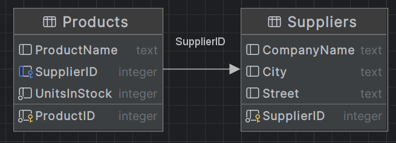
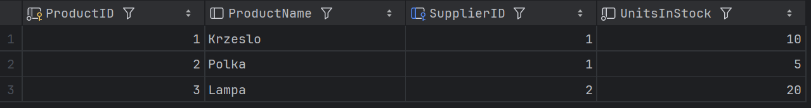
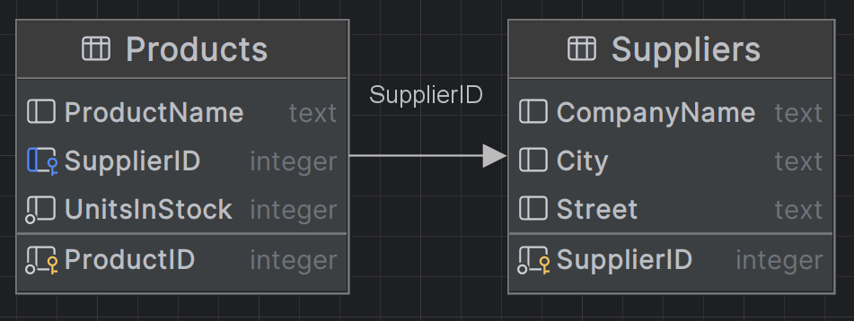
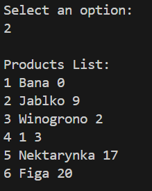

# Sprawozdanie Bazy Danych laboratorium 5
## Entity Framework

### Jakub Fabia, Michał Gontarz

# Stan przed 1 zadaniem

## Klasy

### ProdContext

```cs
using Microsoft.EntityFrameworkCore;
public class ProdContext : DbContext
{
    public DbSet<Product> Products { get; set; }
    protected override void OnConfiguring(DbContextOptionsBuilder optionsBuilder)
    {
    base.OnConfiguring(optionsBuilder);
        optionsBuilder.UseSqlite("Datasource=MyProductDatabase");
    }
}
```

### Product

```cs
public class Product
{
    public int ProductID { get; set; }
    public String? ProductName { get; set; } public
    int UnitsInStock { get; set; }
}
```

### Program

```cs
using System;
using System.Linq;

ProdContext productContext = new ProdContext();
Console.WriteLine("Input product name:");
string? input = Console.ReadLine();
if (input == null)
{
    Console.WriteLine("No input provided.");
    return;
}
string ProductName = input;
Product product = new Product { ProductName = ProductName };
productContext.Products.Add(product);
productContext.SaveChanges();
var query = from prod in productContext.Products
    select prod.ProductName;

Console.WriteLine();
Console.WriteLine("Products List:");

foreach (var pName in query)
{
    Console.WriteLine(pName);
}
```

## Schemat 


## Działanie 


# Zadanie 1

Dodaliśmy nową klasę `Supplier`:

```cs
public class Supplier
{
    public int SupplierID { get; set; }
    public string? CompanyName { get; set; }
    public string? City { get; set; }
    public string? Street { get; set; }

    public override string ToString()
    {
        return $"{SupplierID} {CompanyName} {City} {Street}";
    }
}
```

Stworzyliśmy nową tabelę w `ProdContext`:

```cs
using Microsoft.EntityFrameworkCore;
public class ProdContext : DbContext
{
    public DbSet<Product> Products { get; set; }
    public DbSet<Supplier> Suppliers { get; set; }
    protected override void OnConfiguring(DbContextOptionsBuilder optionsBuilder)
    {
        base.OnConfiguring(optionsBuilder);
        optionsBuilder.UseSqlite("Datasource=MyProductDatabase");
    }
}
```

Stworzyliśmy nowy kontekst i odświerzyliśmy bazę danych.

```bash
PS C:\Users\Jakub Fabia\Documents\SEMESTR4\Bazy\lab05> dotnet ef migrations add InitSupplierDatabase
Build started...
Build succeeded.
Done. To undo this action, use 'ef migrations remove'
PS C:\Users\Jakub Fabia\Documents\SEMESTR4\Bazy\lab05> dotnet ef database update
Build started...
Build succeeded.
```

Dodaliśmy nową kolumnę **Supplier** oraz **ToString** w `Product`:

```cs
public class Product
{
    public int ProductID { get; set; }
    public String? ProductName { get; set; }
    public int UnitsInStock { get; set; }

    public Supplier? Supplier { get; set; }

    public override string ToString()
    {
        return $"{ProductID} {ProductName} {UnitsInStock} {Supplier?.CompanyName}";
    }
}
```

I zaktualizowaliśmy `Program` dla większej czytelności i łatwości dodawania elementów:

```cs
public class Program
{
    public static void Main()
    {
        ProdContext productContext = new ProdContext();
        Product product = createProduct();
        Supplier? supplier;
        Console.WriteLine("Create new supplier (y/[n]):");
        string option = Console.ReadLine();
        if (option.ToLower() == "y")
        {
            supplier = createSupplier();
            productContext.Suppliers.Add(supplier);
        }
        else
        {
            var suppliersQuery = from prod in productContext.Suppliers select prod;
            Console.WriteLine();
            Console.WriteLine("Suppliers List:");
            foreach (var pName in suppliersQuery)
            {
                Console.WriteLine(pName);
            }
            Console.WriteLine("Input supplier ID:");
            int supplierID = Convert.ToInt32(Console.ReadLine());
            supplier = productContext.Suppliers.Find(supplierID);
            if (supplier == null)
            {
                Console.WriteLine("Supplier not found.");
                return;
            }
        }

        product.Supplier = supplier;
        productContext.Products.Add(product);
        productContext.SaveChanges();
        
        var productsQuery = from prod in productContext.Products select prod;

        Console.WriteLine();
        Console.WriteLine("Products List:");

        foreach (var pName in productsQuery)
        {
            Console.WriteLine(pName);
        }
    }
    private static Product createProduct()
    {
        Console.WriteLine("Input product name:");
        string ProductName = Console.ReadLine();
        Console.WriteLine("Input product units in stock:");
        int UnitsInStock = Convert.ToInt32(Console.ReadLine());
        return new Product { ProductName = ProductName, UnitsInStock = UnitsInStock };
    }
    private static Supplier createSupplier()
    {
        Console.WriteLine("Input supplier company name:");
        string CompanyName = Console.ReadLine();
        Console.WriteLine("Input supplier city:");
        string City = Console.ReadLine();
        Console.WriteLine("Input supplier street:");
        string Street = Console.ReadLine();
        return new Supplier { CompanyName = CompanyName, City = City, Street = Street };
    }
}
```

## Schemat



## Działanie


## Stan bazy




# Zadanie 2

Klasami w których coś się zmieniło są:

### Program

Zmieniło się od linijki 9 z poprzedniego zadania, wklejam całe wyrażenie warunkowe dla czytelności.

```cs
if (option.ToLower() == "y")
{
    supplier = createSupplier();
    supplier.Products.Add(product);
    productContext.Suppliers.Add(supplier);
}
else
{
    var suppliersQuery = from prod in productContext.Suppliers select prod;
    Console.WriteLine();
    Console.WriteLine("Suppliers List:");
    foreach (var pName in suppliersQuery)
    {
        Console.WriteLine(pName);
    }
    Console.WriteLine("Input supplier ID:");
    int supplierID = Convert.ToInt32(Console.ReadLine());
    supplier = productContext.Suppliers.Find(supplierID);
    if (supplier == null)
    {
        Console.WriteLine("Supplier not found.");
        return;
    }
    supplier.Products.Add(product);
    productContext.Suppliers.Update(supplier);
}
```

Oraz usunięto 

```cs
product.Supplier = supplier;
```

Zaraz pod tym wyrażeniem.

### Product

```cs
public class Product
{
    public int ProductID { get; set; }
    public String? ProductName { get; set; }
    public int UnitsInStock { get; set; }
    public override string ToString()
    {
        return $"{ProductID} {ProductName} {UnitsInStock}";
    }
}
```

### Supplier

```cs
public class Supplier
{
    public int SupplierID { get; set; }
    public string? CompanyName { get; set; }
    public string? City { get; set; }
    public string? Street { get; set; }
    public ICollection<Product> Products { get; set; } = new List<Product>();

    public override string ToString()
    {
        return $"{SupplierID} {CompanyName} {City} {Street}";
    }
}
```

## Schemat


Jak widać w `Data Gripie` kierunek strzałki się nie zmienił, zobatrzmy na wynik zapytania `SELECT`.

## Działanie


## Stan bazy

#### SELECT * FROM Suppliers


Pomimo zmiany struktury w `Product.cs` oraz `Supplier.cs`, nie widać kolumny `Products` w tabeli `Suppliers`.

#### SELECT * FROM Products


Tutaj widać, że w porówaniu do produktów dodawanych w zadaniu 1, nic się nie zmieniło, więc to Entity Framework musi to tłumaczyć i zapisywać w tabelach w optymalny sposób.


# Zadanie 3

### Product

```cs
public class Product
{
    public int ProductID { get; set; }
    public String? ProductName { get; set; }
    public int UnitsInStock { get; set; }

    public Supplier? Supplier { get; set; }

    public override string ToString()
    {
        return $"{ProductID} {ProductName} {UnitsInStock} {Supplier?.CompanyName}";
    }
}
```

### Supplier

Pozostaje bez zmian.

### Program

Pozostaje bez zmian, za wyjątkiem dodania spowrotem linijki:

```cs
product.Supplier = supplier;
```

## Schemat



Na schemacie ponownie bez zmian w porównaniu do zadania 1 oraz 2.

## Działanie


## Stan bazy

#### SELECT * FROM Suppliers


#### SELECT * FROM Products


Także bez zmian w porównaniu do 1 oraz 2.

# Zadanie 4

## Klasy

### Invoice

```cs
internal class Invoice
{
    public int InvoiceID { get; set; }
    public virtual ICollection<InvoiceDetail> InvoiceDetails { get; set; }
}
```

### InvoiceDetail

```cs
using System.ComponentModel.DataAnnotations;
using System.ComponentModel.DataAnnotations.Schema;
class InvoiceDetail
{
    [Key, Column(Order = 0)]
    public int InvoiceID { get; set; }

    [Key, Column(Order = 1)]
    public int ProductID { get; set; }

    public virtual Invoice Invoice { get; set; }
    public virtual Product Product { get; set; }

    public int Quantity { get; set; }

    public override string ToString()
    {
        return $"{Product} {Quantity}";
    }
}
```

### ProdContext

```cs
using Microsoft.EntityFrameworkCore;
internal class ProdContext : DbContext
{
    public DbSet<Product> Products { get; set; }
    public DbSet<Invoice> Invoices { get; set; }
    public DbSet<InvoiceDetail> InvoiceDetails { get; set; }
    protected override void OnModelCreating(ModelBuilder modelBuilder)
    {
        base.OnModelCreating(modelBuilder);
        modelBuilder.Entity<InvoiceDetail>()
            .HasKey(id => new { id.InvoiceID, id.ProductID });
    }
    protected override void OnConfiguring(DbContextOptionsBuilder optionsBuilder)
    {
        base.OnConfiguring(optionsBuilder);
        optionsBuilder.UseSqlite("Datasource=MyProductDatabase");
    }
}
```

### Product

```cs
internal class Product
{
    public int ProductID { get; set; }
    public String? ProductName { get; set; }
    public int UnitsInStock { get; set; }
    public virtual ICollection<InvoiceDetail> InvoiceDetails { get; set; }
    public override string ToString()
    {
        return $"{ProductID} {ProductName} {UnitsInStock}";
    }
}
```

### Program

```cs
public class Program
{
    public static void Main()
    {
        ProdContext productContext = new ProdContext();
        while (true)
        {
            Console.WriteLine();
            Console.WriteLine("1 - Create Product");
            Console.WriteLine("2 - View Products");
            Console.WriteLine("3 - Place Order");
            Console.WriteLine("4 - View Orders");
            Console.WriteLine("5 - Exit");
            Console.WriteLine("Select an option:");
            string option = Console.ReadLine();
            switch (option)
            {
                case "1":
                    createProduct(productContext);
                    Thread.Sleep(1000);
                    break;
                case "2":
                    viewProducts(productContext);
                    Thread.Sleep(1000);
                    break;
                case "3":
                    placeOrder(productContext);
                    Thread.Sleep(1000);
                    break;
                case "4":
                    ViewOrders(productContext);
                    Thread.Sleep(1000);
                    break;
                case "5":
                    return;
                default:
                    Console.WriteLine("Invalid option. Please try again.");
                    break;
            }
        }
    }
    private static void createProduct(ProdContext productContext)
    {
        Console.WriteLine("Input product name:");
        string ProductName = Console.ReadLine();
        Console.WriteLine("Input product units in stock:");
        int UnitsInStock = Convert.ToInt32(Console.ReadLine());
        productContext.Products.Add(new Product { ProductName = ProductName, UnitsInStock = UnitsInStock });
        productContext.SaveChanges();
    }
    private static void viewProducts(ProdContext productContext)
    {
        var productsQuery = from prod in productContext.Products select prod;
        Console.WriteLine();
        Console.WriteLine("Products List:");
        foreach (var pName in productsQuery)
        {
            Console.WriteLine(pName);
        }
    }
    private static void placeOrder(ProdContext productContext)
    {
        Invoice invoice = new Invoice();
        invoice.InvoiceDetails = new List<InvoiceDetail>();
        bool continueAdding = true;
        while (continueAdding)
        {
            Console.WriteLine("Input product ID:");
            int productID = Convert.ToInt32(Console.ReadLine());
            Product? product = productContext.Products.Find(productID);
            if (product == null)
            {
                Console.WriteLine("Product not found.");
                return;
            }
            Console.WriteLine("Input quantity:");
            int quantity = Convert.ToInt32(Console.ReadLine());
            if (quantity > product.UnitsInStock)
            {
                Console.WriteLine("Insufficient stock.");
                return;
            }
            InvoiceDetail invoiceDetail = new InvoiceDetail
            {
                InvoiceID = invoice.InvoiceID,
                ProductID = product.ProductID,
                Quantity = quantity
            };
            productContext.InvoiceDetails.Add(invoiceDetail);
            product.UnitsInStock -= quantity;
            product.InvoiceDetails.Add(invoiceDetail);
            productContext.Products.Update(product);
            invoice.InvoiceDetails.Add(invoiceDetail);
            Console.WriteLine("Do you want to add another product to the invoice? (y/[n]):");
            string option = Console.ReadLine();
            if (option.ToLower() != "y")
            {
                continueAdding = false;
                break;
            }
        }

        productContext.Invoices.Add(invoice);
        productContext.SaveChanges();
    }
    private static void ViewOrders(ProdContext productContext)
    {
        var detailsQuery = from det in productContext.InvoiceDetails
                           select new { det.InvoiceID, det.Product.ProductName, det.Quantity };
        Console.WriteLine();
        Console.WriteLine("Invoices List:");
        foreach (var detail in detailsQuery)
        {
            Console.WriteLine(detail);
        }
    }
}
```

## Schemat


## Działanie

### Menu


### Tworzenie Produktu


### Lista Produktów



### Składanie zamówienia

#### Niewystarczająca ilość


#### Kilka produktów


### Lista zamówień


## Stan bazy

#### SELECT * FROM Products


#### SELECT * FROM InvoiceDetails


#### SELECT * FROM Invoices


# Zadanie 5

## Klasy

### Company

```cs
public class Company
{
    public int CompanyID { get; set; }
    public string CompanyName { get; set; }
    public string Street { get; set; }
    public string City { get; set; }
    public string Zip { get; set; } 
}
```

### Supplier

```cs
public class Supplier : Company
{
    public int SupplierID { get; set; }
    public string bankAccountNumber { get; set; }
    public override string ToString()
    {
        return $"{CompanyName} - {Street}, {City}, {Zip} (Bank Account: {bankAccountNumber})";
    }
}
```

### Customer

```cs
public class Customer : Company
{
    public int CustomerId { get; set; }
    public int Discount { get; set; }

    public override string ToString()
    {
        return $"{CompanyName} - {Street}, {City}, {Zip} (Discount: {Discount}%)";
    }
}
```

### ProdContext

```cs
using Microsoft.EntityFrameworkCore;
internal class ProdContext : DbContext
{
    public DbSet<Company> Companies { get; set; }
    public DbSet<Customer> Customers { get; set; }
    public DbSet<Supplier> Suppliers { get; set; }
    protected override void OnConfiguring(DbContextOptionsBuilder optionsBuilder)
    {
        base.OnConfiguring(optionsBuilder);
        optionsBuilder.UseSqlite("Datasource=MyProductDatabase");
    }
}
```

### Program

```cs
public class Program
{
    public static void Main()
    {
        ProdContext productContext = new ProdContext();
        while (true)
        {
            Console.WriteLine();
            Console.WriteLine("1 - Create Company");
            Console.WriteLine("2 - View Companies");
            Console.WriteLine("3 - Exit");
            Console.WriteLine("Select an option:");
            string option = Console.ReadLine();
            switch (option)
            {
                case "1":
                    createCompany(productContext);
                    Thread.Sleep(1000);
                    break;
                case "2":
                    viewCompanies(productContext);
                    Thread.Sleep(1000);
                    break;
                case "3":
                    return;
                default:
                    Console.WriteLine("Invalid option. Please try again.");
                    break;
            }
        }
    }
    private static void createCompany(ProdContext productContext)
    {
        Console.WriteLine("Enter Company Name:");
        string companyName = Console.ReadLine();
        Console.WriteLine("Enter Street:");
        string street = Console.ReadLine();
        Console.WriteLine("Enter City:");
        string city = Console.ReadLine();
        Console.WriteLine("Enter Zip:");
        string zip = Console.ReadLine();
        Console.WriteLine("Choose Company Type:");
        Console.WriteLine("1 - Customer");
        Console.WriteLine("2 - Supplier");
        string companyType = Console.ReadLine();
        if (companyType != "1" && companyType != "2")
        {
            Console.WriteLine("Invalid company type. Please try again.");
            return;
        }
        if (companyType == "1")
        {
            Console.WriteLine("Enter Discount:");
            int discount = Convert.ToInt32(Console.ReadLine());
            Customer customer = new Customer
            {
                CompanyName = companyName,
                Street = street,
                City = city,
                Zip = zip,
                Discount = discount
            };
            productContext.Companies.Add(customer);
        }
        else
        {
            Console.WriteLine("Enter Bank Account Number:");
            string bankAccNum = Console.ReadLine();
            Supplier supplier = new Supplier
            {
                CompanyName = companyName,
                Street = street,
                City = city,
                Zip = zip,
                bankAccountNumber = bankAccNum
            };
            productContext.Companies.Add(supplier);
        }
        productContext.SaveChanges();
        Console.WriteLine("Company created successfully.");
    }
    private static void viewCompanies(ProdContext productContext)
    {
        Console.WriteLine("Choose type of companies:");
        Console.WriteLine("1 - Customers");
        Console.WriteLine("2 - Suppliers");
        Console.WriteLine("Else - All Companies");
        string companyType = Console.ReadLine();
        if (companyType == "1")
        {
            foreach (var customer in productContext.Customers)
            {
                Console.WriteLine(customer);
            }
        }
        else if (companyType == "2")
        {
            foreach (var supplier in productContext.Suppliers)
            {
                Console.WriteLine(supplier);
            }
        }
        else
        {
            foreach (var company in productContext.Companies)
            {
                Console.WriteLine(company);
            }
        }
    }
}
```

## Schemat


## Działanie

### Menu


### Tworzenie Klienta


### Tworzenie Dostawcy


### Wyświetlanie

#### Klientów


#### Dostawców


#### Wszystkich


## Stan bazy

#### SELECT * FROM Companies


# Zadanie 6

## Klasy

### Supplier

```cs
using System.ComponentModel.DataAnnotations.Schema;

[Table("Suppliers")]
public class Supplier : Company
{
    public string bankAccountNumber { get; set; }
    public override string ToString()
    {
        return $"{CompanyName} - {Street}, {City}, {Zip} (Bank Account: {bankAccountNumber})";
    }
}
```

### Customer

```cs
using System.ComponentModel.DataAnnotations.Schema;

[Table("Customers")]
public class Customer : Company
{
    public int Discount { get; set; }

    public override string ToString()
    {
        return $"{CompanyName} - {Street}, {City}, {Zip} (Discount: {Discount}%)";
    }
}
```

Reszta pozostaje bez zmian.

## Schemat


## Działanie

Działanie jest dokładnie takie samo jak w poprzednim zadaniu.

## Stan bazy

#### SELECT * FROM Companies


#### SELECT * FROM Suppliers


#### SELECT * FROM Customers


# Zadanie 7 - Porównanie Table-per-Hierarchy i Table-per-Type

## Table-per-Hierarchy

### Opis

Podejście to charakteryzuje się tworzeniem tylko jednej tabeli, w której zapisywane są dane wszystkich klas dziedziczących. Gdy klasa dziedziczące ma kolumnę dodatkową, to dla pozostałych klas w tabeli w tej kolumnie zapisywana jest wartość **null**, a dla tej klasy wartości przypisane do danego obiektu.

### Zalety

- Korzysta z jednej tabeli, więc nie ma potrzeby używania złożonych zapytań z użyciem `JOIN` 
- Wysoka wydajność operacji CRUD ze względu na konieczność edycji tylko jednej tabeli

### Wady

- Redundancja, bardzo dużo wartości w kolumnach dedykowanych klasie dziedziczącej będą wartością `null` 
- Z powodu powyższego, możliwa jest naruszenie integralności danych przy ręcznej edycji

## Table-per-Type

### Opis

Podejście to charakteryzuje się tworzeniem tabeli dla nadklasy ze wszystkimi wspólnymi kolumnami oraz dla wszystkich podklas i ich specyficznych, unikalnych kolumn.

### Zalety

- Zachowana jest integralność danych
- Brak redundancji danych

### Wady

- Wolniejsze wykonywanie operacji CRUD
- Konieczność używania zapytań z `JOIN`